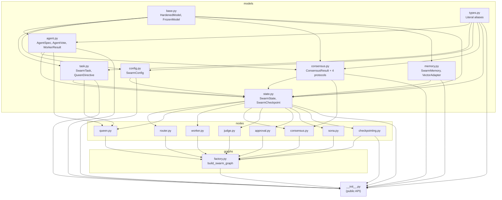

# Import Graph — `hive-swarm/swarm/`

**Verdict:** clean DAG, no cycles. Public API surface (`__init__.py`) imports from every layer; internal layers respect strict ordering: `models → nodes → graphs`.
