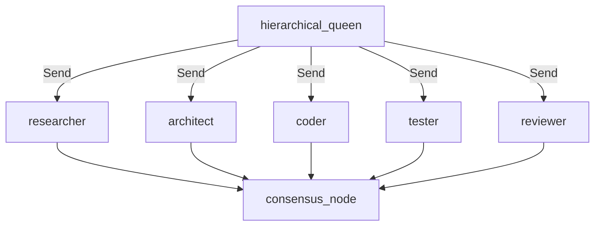
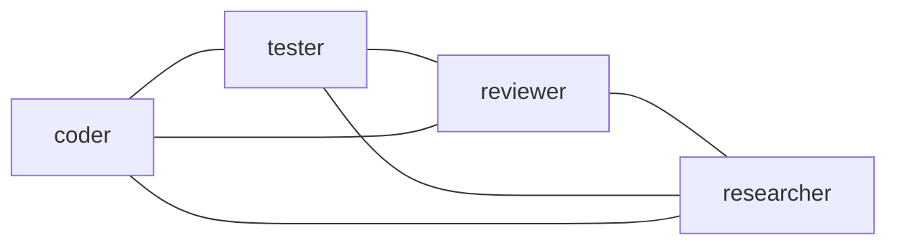
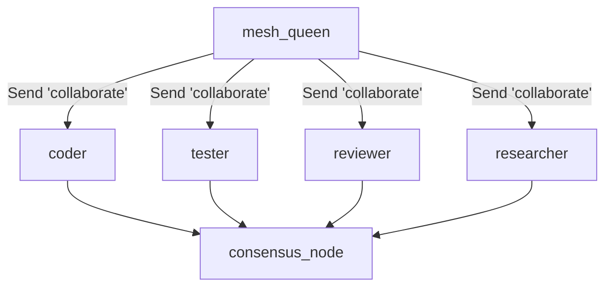
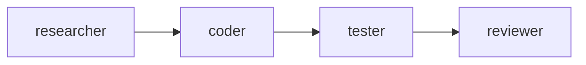
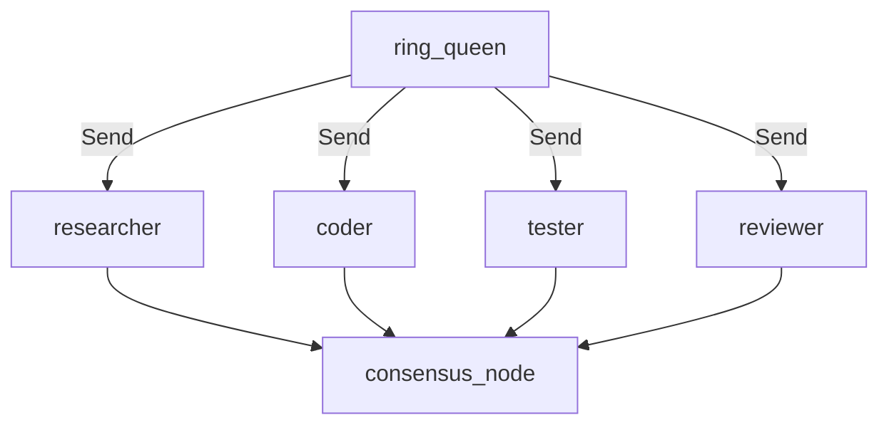
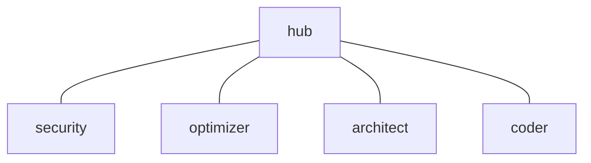
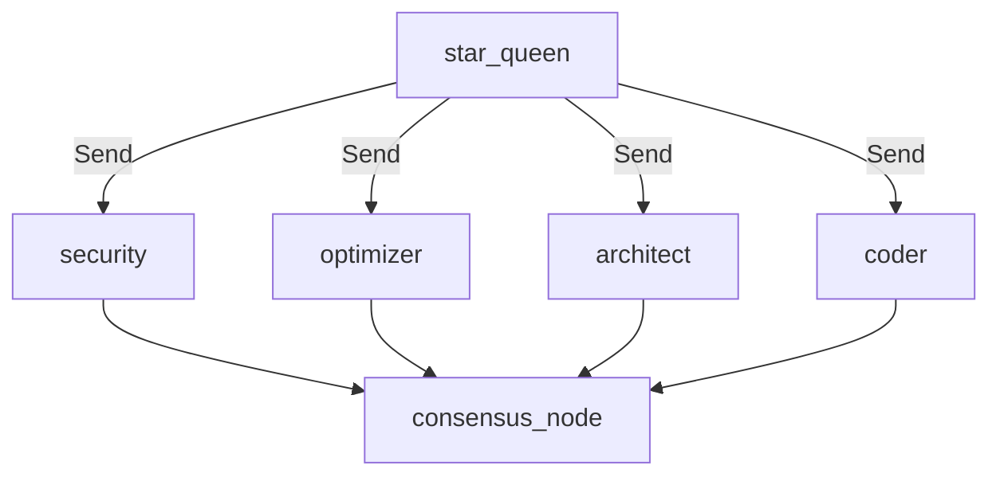
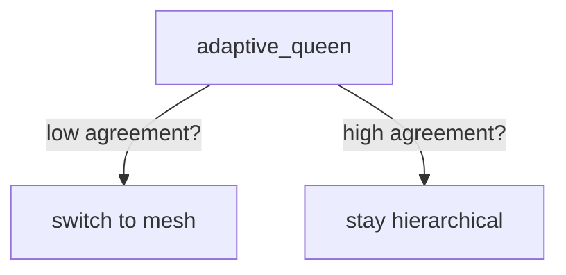
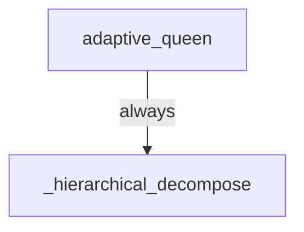

# Topology Diagrams — Intent vs Reality

> All 5 topologies share the same underlying LangGraph shape (parallel Send fan-out + collect + consensus). Only the **role mix** in the worker set varies. See `agents/agent_25_topology.md` finding 25-CORR1.

## Hierarchical (default) — INTENT vs REALITY: matches

## Mesh — INTENT (peer-to-peer)

## Mesh — REALITY (parallel fan-out, identical task strings)

## Ring — INTENT (sequential pipeline)

## Ring — REALITY (parallel)

## Star — INTENT (central hub + isolated spokes)

## Star — REALITY (parallel)

## Adaptive — INTENT (escalates based on prior consensus)

## Adaptive — REALITY (silently aliased to hierarchical)

**Recommendation:** either implement true ring/mesh/star/adaptive, OR rename topologies to `role_set_*` to honestly reflect they only vary the worker role mix.
