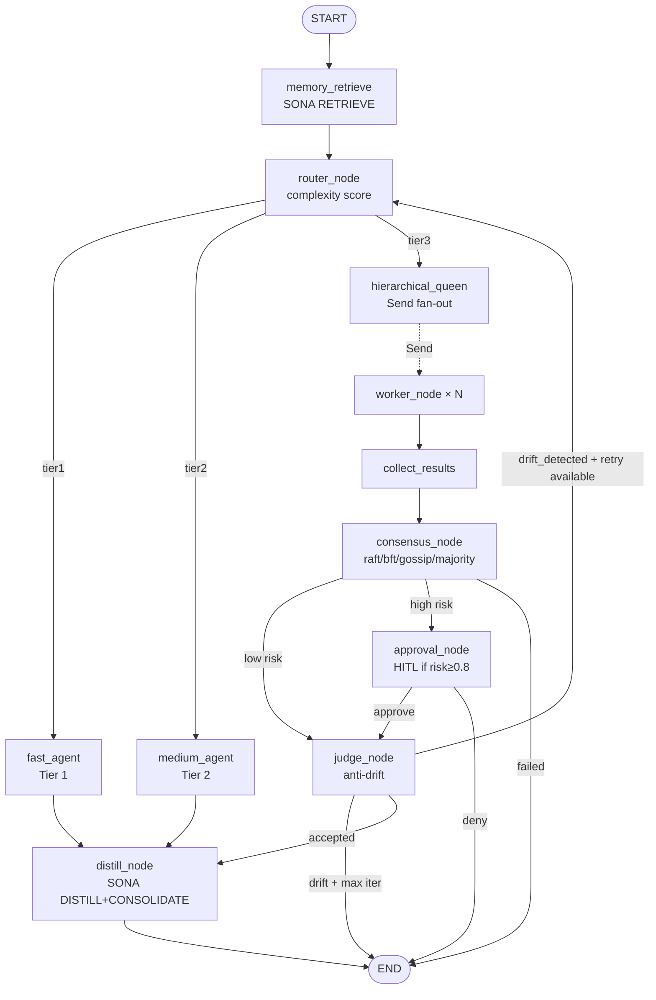
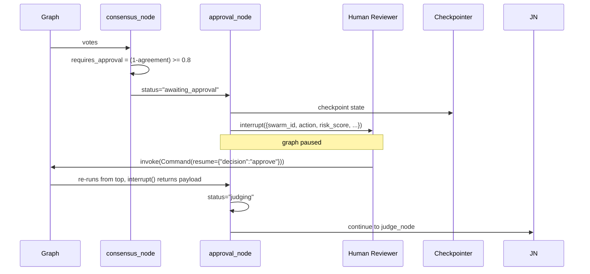
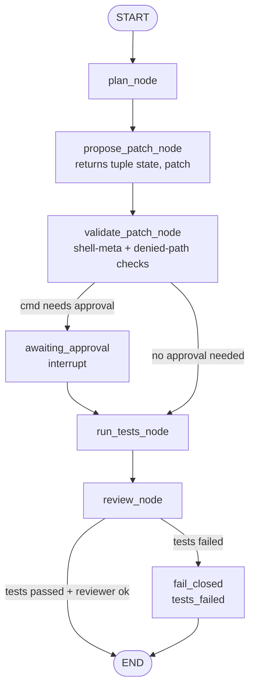
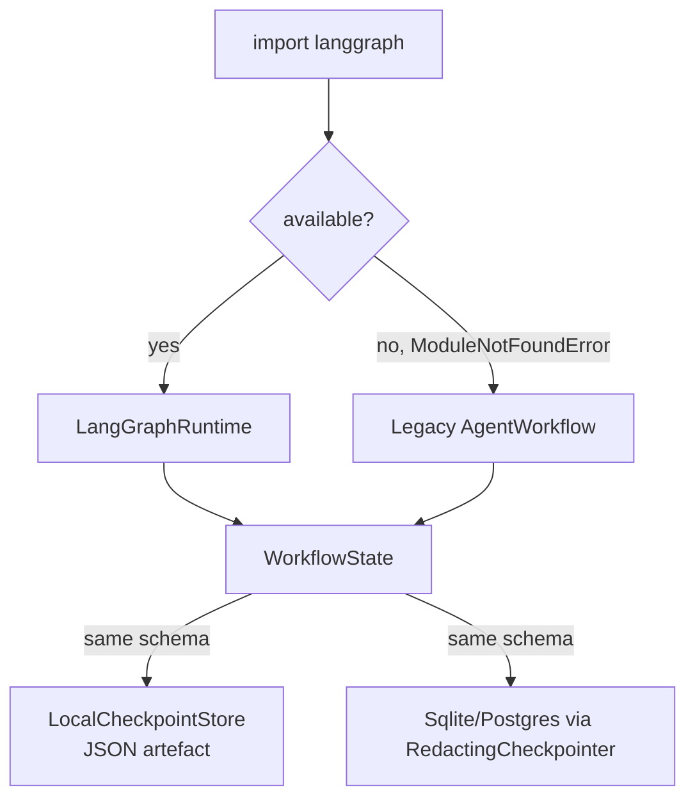
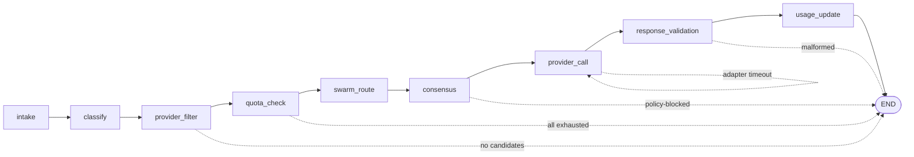
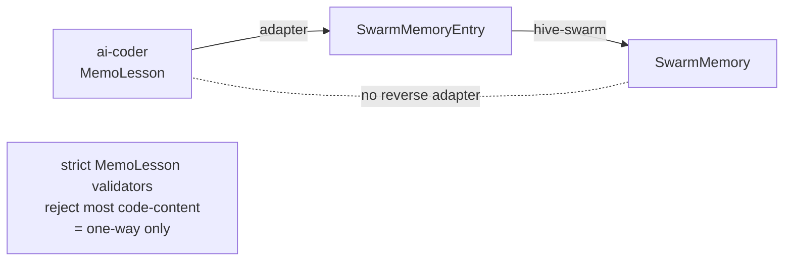

# Workflow Diagrams W1–W6

## W1 — `hive-swarm` happy path

## W2 — `hive-swarm` HITL

## W3 — `ai-coder` LangGraph runtime

## W4 — `ai-coder` legacy fallback

## W5 — `ai-provider-swarm-gateway` 9-node

## W6 — Cross-project memory portability

